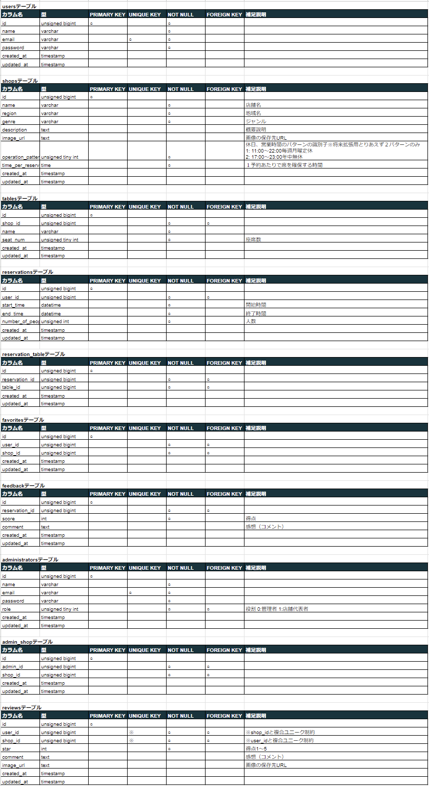

# Atte
飲食店予約サービス

## 作成した目的
webアプリ開発の勉強のため

## アプリケーションURL
* 開発(ローカル)環境  
  http:\//localhost
* 本番(EC2)環境  
  <a href="http://ec2-18-182-45-97.ap-northeast-1.compute.amazonaws.com" target="_blank">http://ec2-18-182-45-97.ap-northeast-1.compute.amazonaws.com</a>
  
## 他のリポジトリ
* ソースコード(GitHub)  
  [https://github.com/takamasa-seto/rese](https://github.com/takamasa-seto/rese)

## 機能一覧
  * 会員登録  
    左上のプルダウンメニューの"アカウント作成"から会員登録画面を表示する。登録時は登録されたメールアドレスに確認メールが送信される。
    
  * ログイン  
    確認メールにより認証されたユーザのみがログイン可能。
  * ログアウト  
    左上のプルダウンメニューからログアウトできる。
    
  * 検索  
    トップページ（または左上のプルダウンメニューの"ホーム"から表示される画面）の右上のメニューから、エリア、ジャンル、店舗名ごとに店舗を検索することができる。検索実行時は、トップページに検索された店舗のみが表示される。
  * 店舗詳細表示  
    トップページ（または左上のプルダウンメニューの"ホーム"から表示される画面）の各店舗情報の"詳しくみる"ボタンを押すと店舗詳細画面を表示する。
  * 予約  
    店舗詳細画面から予約することができる。
  * マイページ表示  
    ログインしたユーザは左上のプルダウンメニューの"マイページ"ボタンから予約情報やお気に入り店舗情報を記載したマイページをみることができる。  
  * 予約変更・キャンセル  
    マイページに表示された各予約情報の"変更"ボタンから予約情報の変更、キャンセルができる。
  * QRコード表示  
    マイページに表示された各予約情報の"QRコード"ボタンから、来店時に提示するためのQRコードを表示することができる。
  * お気に入り登録・解除
    ログインしたユーザはトップページ（または左上のプルダウンメニューの"ホーム"から表示される画面）の各店舗のハートマーク（ログインしていない時は表示されない）をクリックすることでお気に入り登録と解除ができる。お気に入り登録されるとハートマークが赤くなり、マイページに店舗情報が表示されるようになる。
  * 管理者・店舗代表者のログイン  
    上記アプリケーションURLに"admin/login"をつけたURLを直打ちするとログイン画面が表示される。
  * 管理者・店舗代表者一覧表示  
    管理者は、管理者、店舗代表者の一覧を表示した管理画面を左上のプルダウンメニューの"管理者一覧へ"から表示することができる。
      
  * 管理者・店舗代表者の登録・変更
    管理者は、管理画面から管理者、店舗代表者を追加することができる。入力したEmailアドレスが既に登録されている場合は役割や店舗情報が更新される。入力したEmailアドレスが登録されていない場合は、新規に登録される。
   
  * お知らせメール送信
    管理者は、管理画面の"作成"ボタンからユーザにお知らせメールを作成・送信することができる。
  * 店舗情報の更新、作成
    店舗代表者は、左上のプルダウンメニューの"店舗情報の編集"から、自身が担当する店舗の情報を編集することができる。また、"店舗情報の新規登録"から、新規店舗を作成することができる。
      
  * 予約情報一覧表示
    店舗代表者は、左上のプルダウンメニューの"予約一覧"から、自身が担当する店舗の予約一覧をみることができる。
  * 評価機能
    予約後（予約日の夜）にアンケート協力メールを該当ユーザに送信する。ユーザはメールのリンク先にアクセスすることで、店の評価（スコアとコメント）を入力することができる。店舗代表者は、予約一覧を表示した画面から、予約ごとの"詳細"ボタンにより、各予約の詳細を表示することができ、評価結果はそこから閲覧することができる。

## 使用技術(実行環境)
  * 開発フレームワーク  
    laravel8.83.8  
    ※ ユーザ認証にはBreezeを使用
  * 仮想サーバ  
    EC2 (本番環境のみ)
  * データベース  
    RDS (本番環境のみ)
  * ストレージ
    s3（本番環境のみ）
  * メール送信  
    Amazon SES (本番環境)  
    MailHog (開発(ローカル)環境)

## テーブル設計

## ER図

# 環境構築
## 開発（ローカル）環境
ローカルでのテスト環境のセットアップ手順を示します。  
* GitHubの上記リポジトリのクローンを作業フォルダに作成。
  > git clone https://github.com/takamasa-seto/rese.git
* クローンしたatteフォルダ直下に移動。
* docker-compose-dev.ymlファイルをつかってDockerコンテナを起動。
  > docker-compose -f docker-compose-dev.yml up -d --build  
* phpコンテナにログインし、composerをインストールする。
  > docker-compose -f docker-compose-dev.yml exec php bash  
  > composer install  
* srcフォルダ直下に.env.dev.exampleのコピーを作成する。
  > cp .env.dev.example .env  
* コピーした.envファイルの次の部分を編集する。
  > DB_PASSWORD=(任意のパスワード)  
* アプリケーションキーを作成する(phpコンテナにログインした状態)。
  > php artisan key:generate  
* データベースのマイグレーション(phpコンテナにログインした状態)。
  > php artisan migrate  
* 店舗情報のダウンロード
  > bash download-images.sh  
* マルチ認証用のrese直下のAdminResetPassword.phpを配置する
  > cp AdminResetPassword.php vendor/laravel/framework/src/illuminate/Auth/Notifications  
* 店舗情報をシーディングする
  > php artisan db:seed --class AddShopsCsv  
* 管理者情報をシーディングする※src/database/seeders/admins.csvの内容は適切に設定してください
  > php artisan db:seed --class AddAdminsCsv  
* ストレージのシンボリックリンクを作成
  > php artisan storage:link  
* スケジューラの実行  
  > php artisan schedule:work  

## 本番環境
EC2(仮想サーバ)とRDS(データベース)をつかった本番環境のセットアップ手順を示します。
* AWSのEC2インスタンス、RDS、SESのID、s3のバケットを作成しておく。
* GitHubの上記リポジトリのクローンをEC2のインスタンスに作成。
  > git clone https://github.com/takamasa-seto/rese.git
* クローンしたatteフォルダ直下に移動。
* docker-compose-prod.ymlファイルをつかってDockerコンテナを起動。
  > docker-compose -f docker-compose-prod.yml up -d --build  
* phpコンテナにログインし、composerをインストール準備（エラー対策）する。
  > docker-compose -f docker-compose-prod.yml exec php bash  
  > apt-get update --allow-releaseinfo-change  
  > apt-get install -y libpng-dev libjpeg62-turbo-dev && docker-php-ext-configure gd --with-jpeg && docker-php-ext-install -j$(nproc) gd  
  > docker-compose -f docker-compose-prod.yml exec php bash  
  > composer install  
* phpコンテナにログインし、composerをインストールする。  
  > composer install  
* srcフォルダ直下に.env.prod.exampleのコピーを作成する。
  > cp .env.prod.example .env
* コピーした.envファイルの次の部分を編集する。
  > APP_URL=(EC2のオープンアドレス)  
  > DB_HOST=(RDSのエンドポイント)  
  > DB_DATABASE=(RDSで設定したデータベース名)  
  > DB_USERNAME=(RDSで設定したユーザ名)  
  > DB_PASSWORD=(RDSで設定したパスワード)  
  > MAIL_FROM_ADDRESS=(SESで設定したメールアドレス)  
  > AWS_ACCES_KEY_ID=(AWSのアクセスキー)  
  > AWS_SECRET_ACCES_KEY_ID=(AWSのシークレットアクセスキー)  
  > AWS_DEFAULT_REGION=(SESで設定したリージョン。日本はap-northeast-1)  
  > AWS_BUCKET=(s3のバケット名)  
  > AWS_URL=https://s3-ap-northeast-1.amazonaws.com/(s3のバケット名)  

* アプリケーションキーを作成する(phpコンテナにログインした状態)。
  > php artisan key:generate  
* データベースのマイグレーション(phpコンテナにログインした状態)。
  > php artisan migrate  
* マルチ認証用のrese直下のAdminResetPassword.phpを配置する
  > cp AdminResetPassword.php vendor/laravel/framework/src/illuminate/Auth/Notifications  
* 店舗情報をシーディングする
  > php artisan db:seed --class AddShopsCsv  
* 管理者情報をシーディングする※src/database/seeders/admins.csvの内容は適切に設定してください
  > php artisan db:seed --class AddAdminsCsv  
* スケジューラの実行(phpコンテナにログインした状態)。  
  ※ ここでの処理はdocker化して自動にする予定。
  * Cronのインストール。  
    > apt-get install cron  
  * Cronの設定ファイルを編集するためにVIエディタをインストール。  
    > apt-get install vim  
  * Cronの設定ファイルをVIエディタで開く。
    > crontab -e  
  * Cronの設定ファイルに↓のコマンドを追加し、保存して閉じる。
    > \* * * * * cd (プロジェクトのフルパス(例:/var/www)) && (PHPのフルパス(例:/usr/local/bin/php)) artisan schedule:run >> /dev/null 2>&1  
  * Cronを起動。  
    > service cron start  

    ※ Cronが起動しているかの確認↓  
      > service cron status  

    ※ crontabの内容の確認↓  
      > crontab -l  